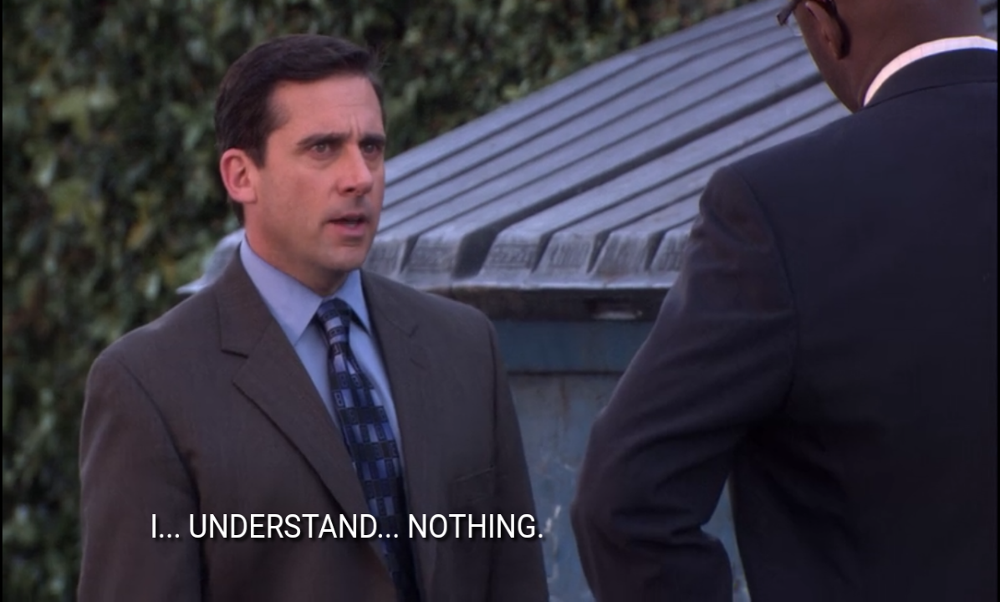
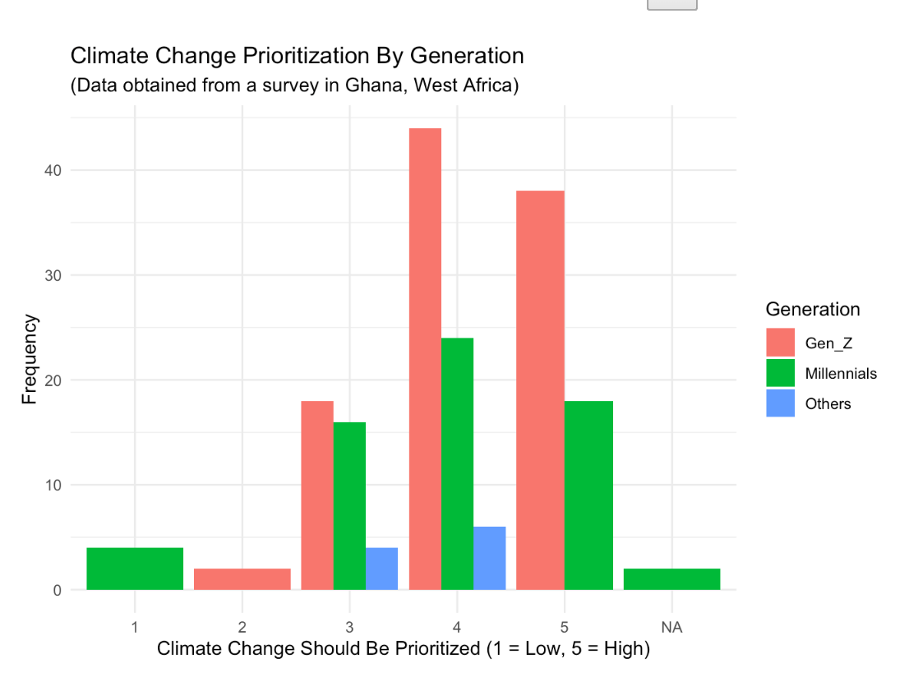
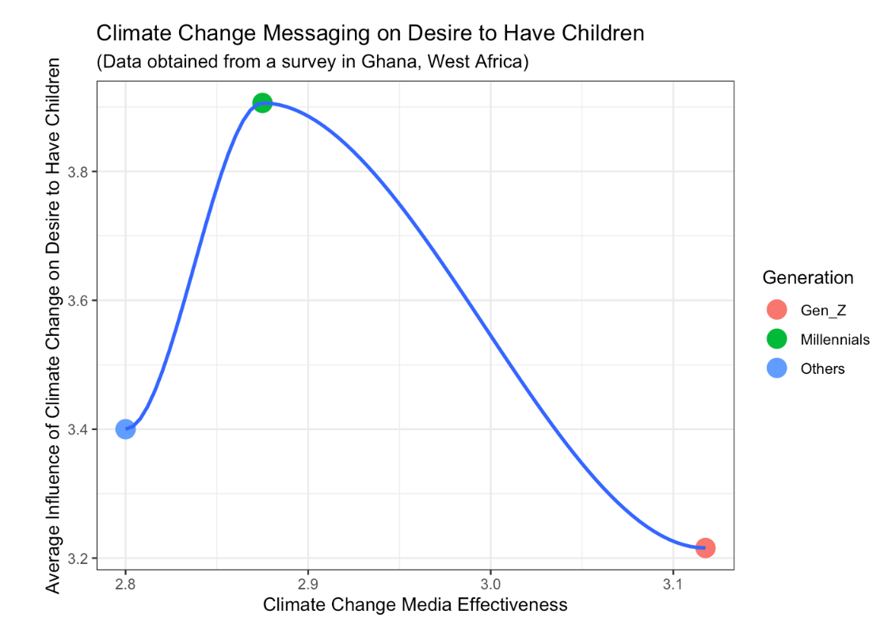

```{r setup, include=FALSE}
options(htmltools.dir.version = FALSE)

library(xaringan)
library(xaringanthemer)
library(tidyverse)
library(knitr)
library(here)
library(kableExtra)
library(janitor)
library(remotes)
library(readr)

```

```{r xaringan-themer, include=FALSE, warning=FALSE}
style_duo_accent(
  primary_color = "#1F4E79",
  secondary_color = "#0072B2",
  header_font_google = google_font("Atkinson Hyperlegible", "600"),
  text_font_google   = google_font("Atkinson Hyperlegible", "300", "300i"),
  code_font_google   = google_font("IBM Plex Mono"),
  colors = c(
    darkblue = "#0072B2",
    lightblue = "#56B4E9",
    darkorange = "#D55E00",
    lightorange = "#E69f00",
    yellow = "#F0E442",
    green = "#009E73",
    pink = "#CC79A7",
    gray = "999999",
    white = "#FFFFFF",
    black = "#000000"
  )
)


```

# Synopsis

- Climate change continues to be perceived as a significant risk among Americans, especially among younger demographics

- Millennials were found to be the group most adamant about prioritizing climate change

- 71% of Millennials said climate change is the most important issue in order to protect and sustain the planet

---

## Laura's Journey

-   I signed up for class wanting to learn if I'm a quantitative or qualitative researcher

-   My advisor told me R would be a helpful skill

-   Class was hard - the hardest class I've ever had

-   I learned I am NOT a quantitative researcher and that R is much more difficult than I realized

-   Presentations in Quarto were actually the easiest part of the class for me!

---

## Sam's Journey

-   Prior to pursuing my PhD, I didn't have much experience as an academic researcher.

-   After taking classes in both methods, I felt more inclined towards quantitative research methods, so I signed up for this class.

-   Having no prior experience with R, I didn't know what to expect. (Spoiler Alert: It hasn't been easy)

-   BUT it has been the right amount of challenging to keep me intrigued.

---

## Sam's Journey Part Two

-   I've spent so many days and hours sitting and trying to figure out all of the assignments.

-   All the frustration didn't compare to feeling of euphoria I had when my code would finally run.

-   So, now I know for sure I'm a quant-leaning researcher.

-   I declared the specialization in Educational Data Science and am enrolled in EDLD652 next term.

---

## Megan's Journey

-   I took this class to expand my research skills

-   And to better than my partner at 'R'!

---

## Update



---

## Megan's Journey

-   All jokes aside, while 'R' has literally been like learning a new language - I better understand the potential 'R' has to improve my future work

-   I have confirmed I'm not exactly a numbers person but, ggplot \< - useful

-   After this class I probably won't pursue more data science courses, but will absolutely continue the various bootcamps and take in data science at a slower pace.

---

## Emmanuel's Journey

-   Started Grad School (Masters) with a phobia for maths and numbers

-   Ended up with a quantitative experiment thesis on health communication

-   I started with SPSS (which is common in communication research) and it was actually easier to work with.

---

## Emmanuel's Journey Part Two

-   Learning R is hard!! But genuinely worth it. I realize I could do even more with R.

-   Of course, because I am now very quantitative, it is one of the standard data analysis tools, meaning I should know it.

-   This class gave me an opportunity to appreciate it more.

---

## Challenges we Faced

-   

---

## Successes

-   Getting charts to run!

-   This project was sent into a large conference and we're hopeful it gets accepted

---


## Current Challenges

-   Waiting for the other results (we have 200ish more surveys heading our way!)

-   Analyzing all questions from the survey (we shortened the list of questions to five for this project)

---

## Findings

-   We found that there is a distinct correlation between climate change anxiety and desires to have children.

-  We also found that those who describe themselves as Gen-Z was likely to say medis is effective at providing climate change information. However, they are less likely than millenials to say they desire to have children.  

---

## Figures



---

## Figures Continued 



---

## Future R Hurdles

-   Difficulties


```{r, include=FALSE, eval=FALSE}

renderthis::to_pdf(here::here("Data Science Assignment", "Assignments", "Final Presentation", "Final Presentation Slides.Rmd"), complex_slides = TRUE)
```

